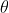
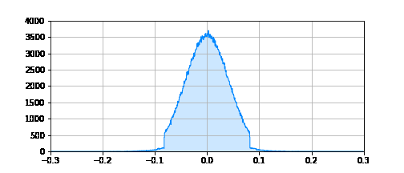
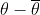
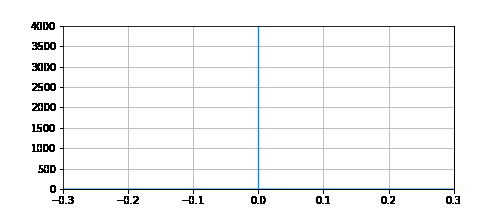
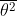
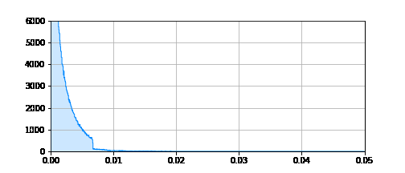

[TensorFlow 2] A Simple Baseline for Bayesian Uncertainty in Deep Learning: SWA-Gaussian (SWAG)
=====
TensorFlow implementation of "A Simple Baseline for Bayesian Uncertainty in Deep Learning"

## Concept

    
  
Algorithm to utilize the SWAG [1].

    
  
Equation for the weight sampling from SWAG [1].

## Results

<table>
  
The red color and the blue color represent the initial state and current state respectively.
  
  <tr>
    <td><strong>Variable</strong></td>
    <td><strong>MNIST</strong></td>
    <td><strong>CIFAR10</strong></td>
  </tr>
  <tr>
    <td></td>
    <td></td>
    <td></td>
  </tr>
  <tr>
    <td></td>
    <td></td>
    <td></td>
  </tr>
  <tr>
    <td></td>
    <td></td>
    <td></td>
  </tr>
  <tr>
    <td></td>
    <td></td>
    <td></td>
  </tr>
</table>

## Performance

### MNIST
|Method|Accuracy|Precision|Recall|F1-Score|
|:---|:---:|:---:|:---:|:---:|
|Final Epoch|0.99230|0.99231|0.99222|0.99226|
|Best Loss|<strong>0.99350</strong>|<strong>0.99350</strong>|<strong>0.99338</strong>|<strong>0.99344</strong>|
|SWAG (S = 30)|0.99310|0.99305|0.99299|0.99302|
|SWAG (Last Momentum)|0.99340|0.99340|0.99330|0.99335|

### CIFAR10
|Method|Accuracy|Precision|Recall|F1-Score|
|:---|:---:|:---:|:---:|:---:|
|Final Epoch|0.73130|0.73349|0.73130|0.73147|
|Best Loss|0.73240|0.73205|0.73240|0.73099|
|SWAG (S = 30)|<strong>0.74100</strong>|<strong>0.74622</strong>|<strong>0.74100</strong>|<strong>0.74260</strong>|
|SWAG (Last Momentum)|0.73490|0.73888|0.73490|0.73561|  

## Requirements
* Python 3.7.6  
* Tensorflow 2.3.0  
* Numpy 1.18.15
* <a>whiteboxlayer</a> 0.1.15

## Reference
[1] Wesley Maddox et al. (2019). <a href="https://arxiv.org/abs/1902.02476">A Simple Baseline for Bayesian Uncertainty in Deep Learning</a>. arXiv preprint arXiv:1902.02476.
