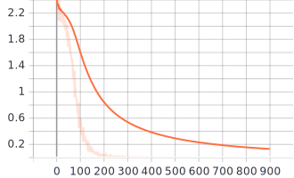

[TensorFlow 2] A Simple Baseline for Bayesian Uncertainty in Deep Learning: SWA-Gaussian (SWAG)
=====
TensorFlow implementation of "A Simple Baseline for Bayesian Uncertainty in Deep Learning" [1]

## Concept

    
  
Algorithm to utilize the SWAG.

    
  
Equation for the weight sampling from SWAG.

## Results

    
  
Loss convergence within training procedure.

    
  
Histogram change of pure weights without stochastic weight averaging.

    
    
  
Histogram change of &theta; and &theta;^2 sequentially. The red color and the blue color represent the initial state and current state respectively.

## Performance
|Method|Accuracy|Precision|Recall|F1-Score|
|:---|:---:|:---:|:---:|:---:|
|Final Epoch|0.99230|0.99231|0.99222|0.99226|
|Best Loss|0.99350|0.99350|0.99338|0.99344|
|SWAG (S = 30)|0.99310|0.99305|0.99299|0.99302|
|SWAG (Last Momentum)|0.99340|0.99340|0.99330|0.99335|

## Requirements
* Python 3.7.6  
* Tensorflow 2.3.0  
* Numpy 1.18.15
* whiteboxlayer 0.1.13

## Reference
[1] Wesley Maddox et al. (2019). <a href="https://arxiv.org/abs/1902.02476">A Simple Baseline for Bayesian Uncertainty in Deep Learning</a>. arXiv preprint arXiv:1902.02476.
